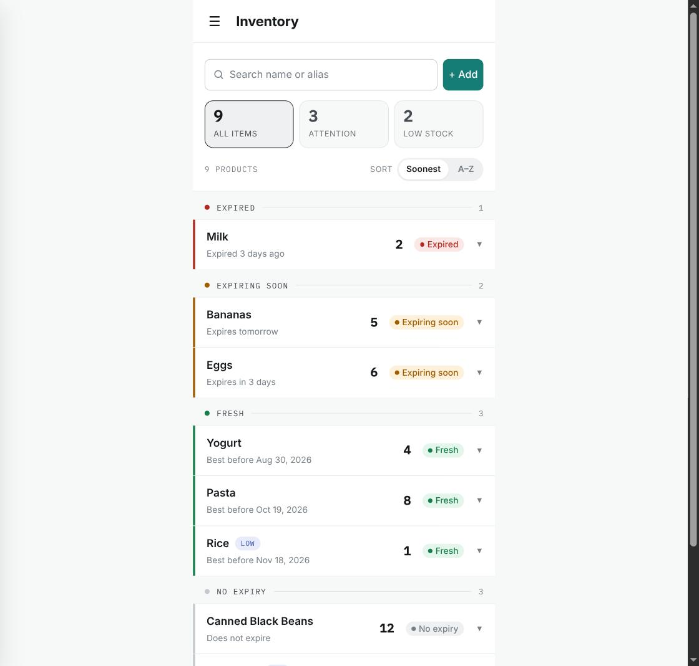
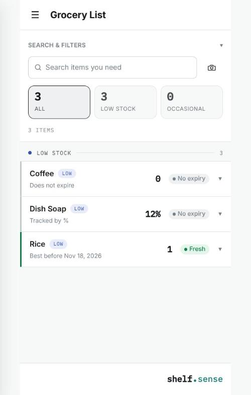
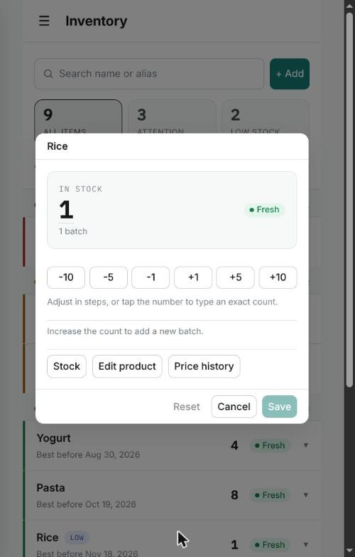
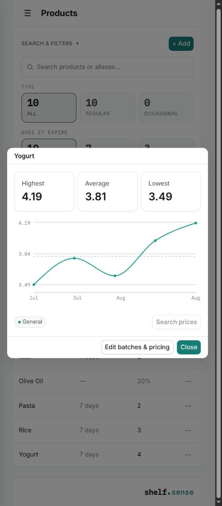
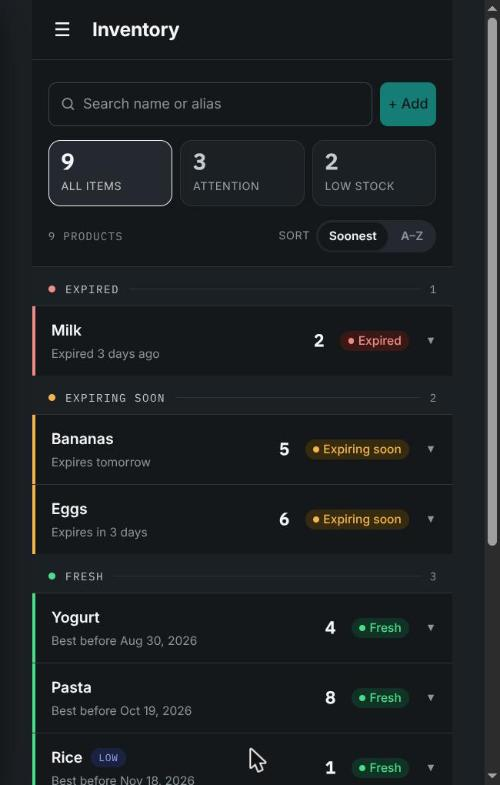
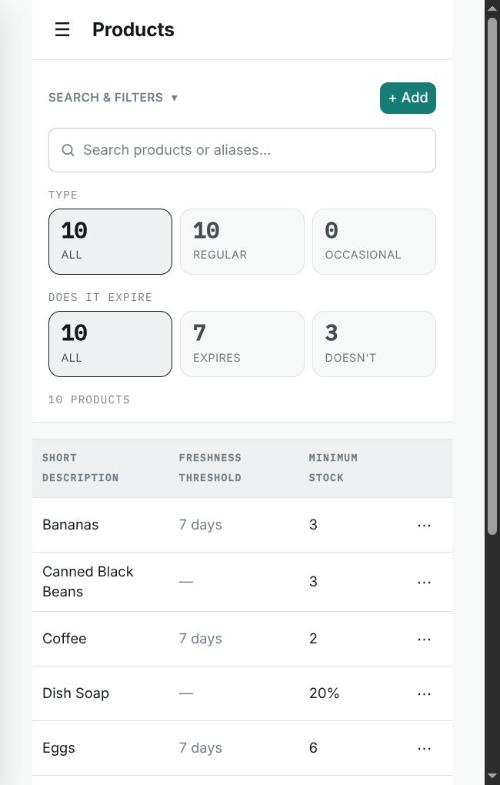
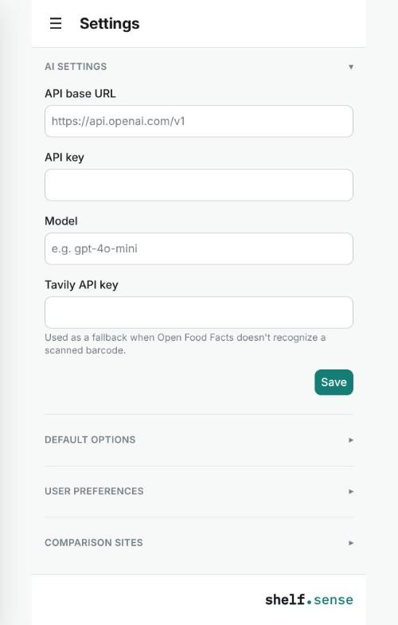

# ShelfSense

Know what's on your shelf. Self-hosted pantry and stock tracking for one household — no accounts, no cloud, no subscription.

[](LICENSE)
[](https://github.com/adilson0888/shelf-sense/pkgs/container/shelf-sense-web)



## Why ShelfSense

Most inventory apps assume you're running a business, or that you're fine handing your grocery habits to someone else's cloud. ShelfSense assumes neither. It's built for one household tracking what's actually in the pantry — what's about to expire, what's running low, what's already gone — and it runs on hardware you control.

There's no account to create, because there's no multi-tenant backend to create it on. Your data lives in a Postgres database you own, on a machine you own. The only outside calls ShelfSense ever makes are the ones *you* configure: Open Food Facts for barcode lookups (free, no key needed), and optionally Tavily plus your own AI provider for filling in products Open Food Facts doesn't know, or comparing prices across stores you've told it to check. Don't configure those, and ShelfSense makes zero outbound calls beyond your own network.

It's AGPL-3.0 licensed on purpose. Self-host it, fork it, modify it — freely. The one thing the license doesn't allow is someone taking this code, running it as a closed SaaS, and never giving their changes back.

## Features

**Freshness & stock, at a glance**
- Inventory grouped by freshness — expired, expiring soon, fresh, no-expiry — with sticky section headers, so you always see what needs attention first.
- A dedicated Grocery List that surfaces only what's low or already out, so you're not scanning the whole pantry to build a shopping list.
- Relative/percentage tracking for bulk liquids (a jug of olive oil, a bottle of detergent) where a unit count is meaningless — track "20% left" instead of a count that never changes until the bottle's empty.

**Fast interactions**
- Long-press or swipe any item for Quick Batch Edit — a stepper modal for adjusting quantity or expiry without leaving the list, with haptic feedback on supported devices.
- A full Stock Edit view when you need to review or fix every individual batch behind a product's total.
- A full Product List for managing your catalog — thresholds, expiry defaults — independent of what's currently on the shelf.

**Barcode & prices**
- Point your phone's camera at a barcode and ShelfSense finds it — matching your own products first, then Open Food Facts, then (optionally) an AI-assisted web lookup for anything obscure.
- Price History charts every product's price over time, purely from what you've actually logged — no external price data, no guessing.
- Optional price comparison across shopping sites you configure, using your own Tavily and AI provider keys. Hit rate is modest by design — it's a bonus feature, not a promise.

**Yours and private**
- Installable PWA — add it to your home screen, works partially offline.
- Dark and light themes, no flash of the wrong one on load.
- English (US) and Português do Brasil, auto-detected from your browser and overridable in Settings.
- Single household, no accounts, no telemetry, no cloud dependency beyond what you explicitly opt into.

## Screenshots

| | |
|---|---|
|  Grocery List — what's low or out |  Quick Batch Edit — adjust in place |
|  Price History — your own purchase prices |  Inventory — dark theme |
|  Product List — the full catalog |  Settings — AI, Tavily, and defaults |

## Quick start

The fastest way to run ShelfSense is Docker Compose with the prebuilt images:

```bash
curl -O https://raw.githubusercontent.com/adilson0888/shelf-sense/main/docker-compose.registry.yml
docker compose -f docker-compose.registry.yml up -d
```

Then open `http://localhost:8080`. That's it — Postgres, migrations, and both services start together.

For configuring AI/Tavily credentials, running behind HTTPS, building from source, or a bare-metal install, see [INSTALL.md](INSTALL.md).

## Tech stack

A Vite + React 18 + TypeScript SPA (`apps/web`), an Express 4 + TypeScript API (`apps/api`) backed by Postgres via Drizzle ORM with migrations that run automatically on boot, a shared web component library (`shelf-sense-ds`) and i18n package (`shelf-sense-i18n`). Node 24+. Docker images for both `web` and `api` are built and published on every push to `main`.

## Links

- **Install:** [INSTALL.md](INSTALL.md)
- **Contributing / dev setup:** [CONTRIBUTING.md](CONTRIBUTING.md)
- **License:** [AGPL-3.0](LICENSE)

---

Built for one kitchen. If it's useful for yours, it's yours.
